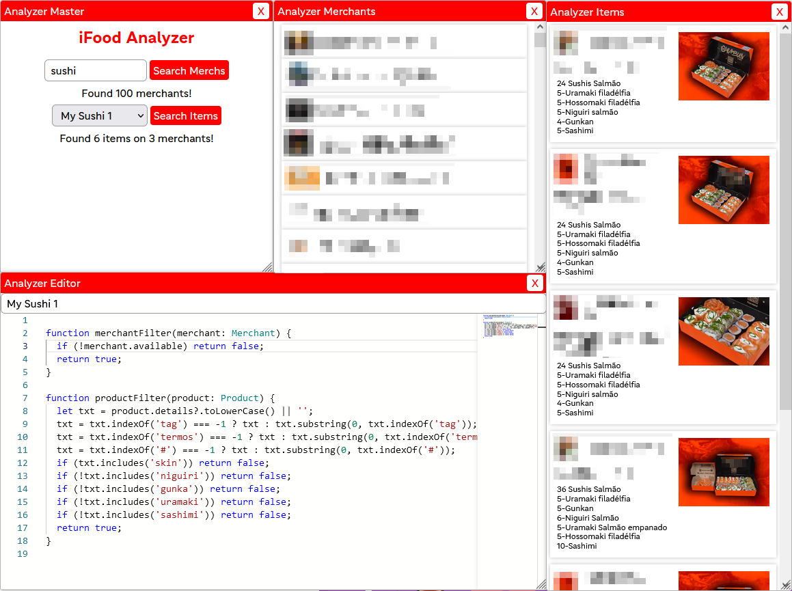

<h1 align="center">
  iFood Analyzer
</h1>

  Browser extension to search for iFood items throught multiple merchants at same time. 
  This is mostly for fun, I have no intention of maintaining this project forever.

  
  

  <b>AD time</b>: This project uses <a href="https://github.com/vanflux/vf-ext">vf-ext</a> to create browser extensions. 
  If you want to create extensions like this, take a look.

## Usage

### **Chrome**

- Download the latest [ifood-analyzer.chrome.zip](https://github.com/vanflux/ifood-analyzer/releases)
- Unzip to some location on your PC
- Go to url chrome://extensions
- Enable development mode
- Load the uncompressed extension and pick the unzipped directory
- Go to ifood.com.br and login on your account

### **Firefox**

- Download the latest [ifood-analyzer.firefox.zip](https://github.com/vanflux/ifood-analyzer/releases)
- Go to url about:debugging
- Go to This Firefox
- Load temporary add-ons and pick the .zip
- Go to ifood.com.br and login on your account

---

## Usage (development)

- Clone repo
- Run `npm i`
- Run `npm start` (or, for firefox, `npm start firefox`)
- Load the extension in development mode on your browser (the extension dir is `build/dev`)

## State

What the extension does at the moment:
- Fetches the 100 first merchants related to a term like "sushi"
- Apply filters to discart some merchants (configured by the user)
- Fetches the catalog of each
- Apply filters to discart products (configured by the user)
- Show the result on a window (merchants + items)

## Goal

(Noo)
- [In progress] Provide some API or UI for the user configure filters to merch & products and get the final cart.
